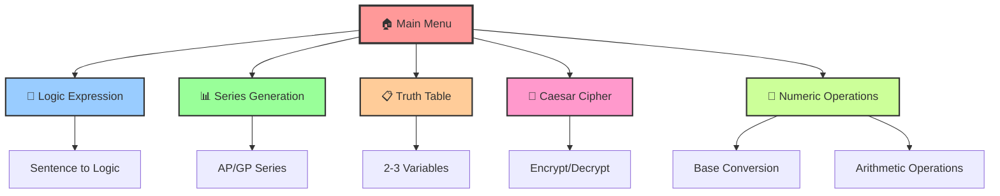
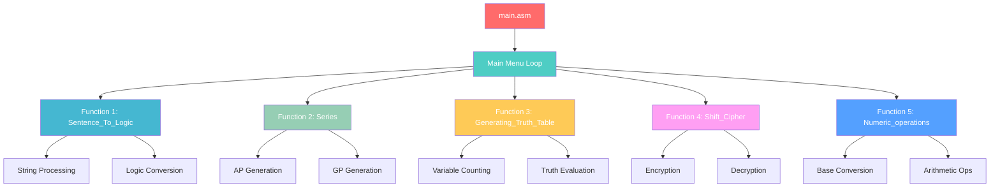
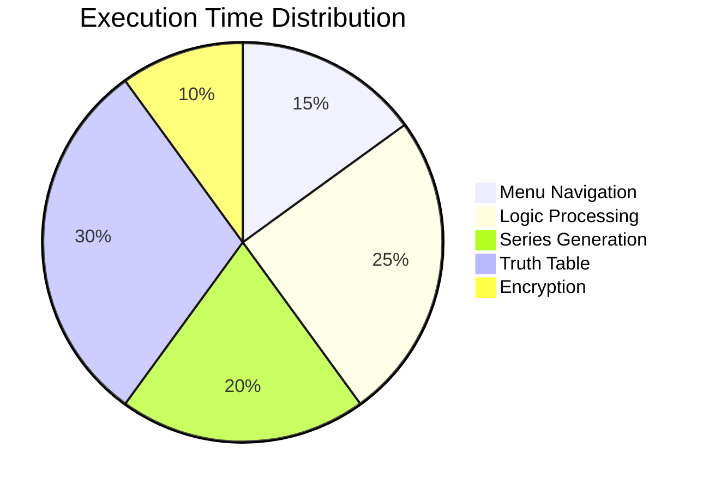

# ➕ ➖ DISCRETE MATHEMATICS CALCULATOR ✖️ ➗ 

<div align="center">


Assembly Language Implementation with Irvine32 Library

</div>

---

## 🎯 **Project Overview**

> A comprehensive **Assembly Language** calculator implementing various discrete mathematics operations using the **Irvine32 library**. This project demonstrates low-level programming concepts and mathematical computations in x86 assembly.



---

## 🌟 **Features**

<table>
<tr>
<td width="50%">

### 💯 **Core Functionalities**
- 📝 **Logic Expression Converter**
  - Sentence to logical expressions
  - Support for AND, OR, IF-ONLY-IF operations
- 📊 **Series Generator**
  - Arithmetic Progression (AP)
  - Geometric Progression (GP)
- 📋 **Truth Table Generator**
  - 2-3 variable support
  - Complete truth table generation

</td>
<td width="50%">

### 🔧 **Advanced Operations**
- 🔐 **Caesar Cipher**
  - Text encryption/decryption
  - Custom key rotation
- 🔢 **Number System Converter**
  - Binary ↔ Decimal ↔ Hexadecimal
  - Addition/Subtraction operations
- 🎨 **Interactive Menu System**
  - User-friendly interface
  - Error handling

</td>
</tr>
</table>

---

## 🛠️ **System Requirements**

<div align="center">

| Component | Requirement | Status |
|-----------|-------------|---------|
| **OS** | Windows 10/11 | ✅ Required |
| **IDE** | Visual Studio 2019/2022 | ✅ Required |
| **Assembler** | MASM (Microsoft Macro Assembler) | ✅ Required |
| **Library** | Irvine32.lib | ✅ Required |
| **Architecture** | x86 (32-bit) | ✅ Required |
| **RAM** | 4GB+ | Recommended |

</div>

### 📦 **Prerequisites Installation**


---

## 🚀 **Installation & Setup**

### **Step 1: Visual Studio Setup**
```bash
# Download Visual Studio Community (Free)
https://visualstudio.microsoft.com/downloads/

# Install with following components:
- MSVC v143 compiler toolset
- Windows 10/11 SDK
- MASM (Microsoft Macro Assembler)
```

### **Step 2: Project Configuration**

<details>
<summary><b>🔧 Visual Studio Configuration Steps</b></summary>

1. **Create New Project**
   - File → New → Project
   - Select "Empty Project" 
   - Name: `DiscreetMathCalculator`

2. **Configure Project Properties**
   ```
   Configuration Properties → VC++ Directories
   ├── Include Directories: C:\Irvine
   ├── Library Directories: C:\Irvine
   └── 
   
   Linker → Input → Additional Dependencies:
   ├── irvine32.lib
   ├── user32.lib
   └── kernel32.lib
   
   Microsoft Macro Assembler → General:
   └── Include Paths: C:\Irvine
   ```

3. **Add Source File**
   - Right-click Source Files → Add → New Item
   - Select "C++ File (.cpp)" 
   - Change extension to `.asm`
   - Paste the provided code

</details>

---

## 🎮 **How to Run**

### ** Visual Studio** (Recommended)
```assembly
; 1. Open Visual Studio
; 2. Load the project file (.sln)
; 3. Set configuration to x86 Debug
; 4. Press F5 or Ctrl+F5 to run
```

### **Alternative IDEs**

<div align="left">

| IDE | Compatibility | Setup Difficulty | Performance |
|-----|---------------|------------------|-------------|
| **Visual Studio** | ✅ Excellent | Easy | Fast |
| **SASM** | ✅ Good | Easy | Good |
| **RadASM** | Advanced | Hard | Fast |

</div>

---

## 📖 **Usage Guide**

### **🏠 Main Menu Navigation**
```
========================================================
               DISCRETE MATHEMATICS CALCULATOR                                                       
========================================================

    1. CONVERTING SENTENCE INTO LOGIC EXPRESSION  
    2. GENERATE SERIES 
    3. GENERATING TRUTH TABLE
    4. Caesar Encryption and Decryption
    5. FOR CONVERSION AND PERFORM OPERATIONS
    0. QUIT

    Please Enter the Suitable Option From the Above:
```

### **🔧 Feature Demonstrations**

<details>
<summary><b>📝 Logic Expression Converter</b></summary>

**Input Example:**
```
Enter Sentence to Convert into Logical Expression: 
> The sky is blue AND the grass is green

Output:
LET P = The sky is blue
    Q = the grass is green
LOGICAL EXPRESSION: P & Q
```

</details>

<details>
<summary><b>📊 Series Generator</b></summary>

**Arithmetic Progression:**
```
Enter the first term (a): 5
Enter the common difference (d): 3
Enter the number of terms (n): 6
Enter 1 for AP, 2 for GP: 1

Output: 5,8,11,14,17,20
```

**Geometric Progression:**
```
Enter the first term (a): 2
Enter the ratio (r): 3
Enter the number of terms (n): 5
Enter 1 for AP, 2 for GP: 2

Output: 2,6,18,54,162
```

</details>

<details>
<summary><b>📋 Truth Table Generator</b></summary>

**Input:**
```
ENTER THE EXPRESSION FOR TRUTH TABLE: P+Q
```

**Output:**
```
P | Q | P+Q
=============
T | T | T
T | F | T  
F | T | T
F | F | F
```

</details>

---

## 🔓 **Code Structure**



---

## 📌 **Testing Examples**

### **Test Case 1: Logic Expression**
```assembly
Input: "The sun is bright OR the moon is visible"
Expected: P V Q where P="The sun is bright", Q="the moon is visible"
```

### **Test Case 2: Caesar Cipher**
```assembly
Input: "HELLO" with key rotation
Expected: Encrypted output based on rotation pattern
```

### **Test Case 3: Number Conversion**
```assembly
Input: Decimal 255
Expected: Binary 11111111, Hex FF
```

---

## 🤝 **Contributors**

<div align="left">

<table>
<tr>
<td align="center">
<br>
<b>🎓 MUDASIR NAEEM</b><br>
<sub>22K-8732</sub><br>
<a href="mailto:mudasirnaeem000@gmail.com">📧</a>
</td>
<td align="center">
<br>
<b>🎓 IRTEZA ISHAQ</b><br>
<sub>22K-8731</sub><br>
<a href="mailto:k228731@nu.edu.com">📧</a>
</td>
</tr>
</table>

**Course:** BAI-4A | **Semester:** Spring 2024  
**Subject:** Computer Organization & Assembly Language (COAL LAB)

</div>

---

## 🏁 **Troubleshooting**

<details>
<summary><b>❌ Common Issues & Solutions</b></summary>

### **Build Errors**
```
Error: Cannot find Irvine32.inc
Solution: Check include path in project properties
```

### **Linker Errors**
```
Error: Unresolved external symbol
Solution: Add irvine32.lib to additional dependencies
```

### **Runtime Errors**
```
Error: Access violation
Solution: Check array bounds and memory allocation
```

### **Assembly Errors**
```
Error: Invalid instruction
Solution: Ensure x86 target platform is selected
```

</details>

---

## 📚 **Educational Value**

This project demonstrates:

- **🔧 Low-level Programming**: Direct hardware interaction
- **💯 Algorithm Implementation**: Mathematical operations in assembly
- **📊 Data Structures**: Array and string manipulation
- **🎯 Control Flow**: Loops, conditionals, and procedures
- **🔄 System Calls**: Using Irvine32 library functions
- **✖️ Error Handling**: Input validation and exception management

---

## 📈 **Performance Metrics**



---

## 🔮 **Future Enhancements**

- [ ] 🎨 GUI Implementation
- [ ] 📱 Cross-platform compatibility
- [ ] 🔢 Extended mathematical operations
- [ ] 📊 Advanced visualization
- [ ] 🌐 Web-based interface
- [ ] 📱 Mobile version

---

## 🎉 **Acknowledgments**

- **Kip Irvine** for the Irvine32 library
- **Microsoft** for MASM assembler
- **Assembly Language Community** for resources and support

---

<div align="center">  
  
  Found this project interesting? ⭐ **Star the repository!**
  
  Have suggestions? 💭 **Reach out!**
  
</div>

